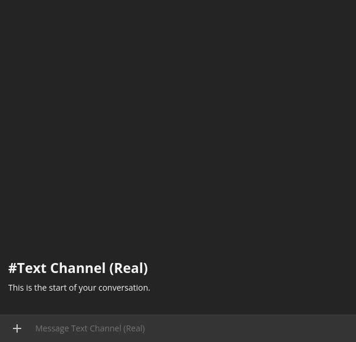

# AutoMod

The best moderation bot for Revolt! \
Or so they say...

 <!-- @EnokiUN made this uwu -->

AutoMod aims to protect your community from spam and malicious actors. It offers powerful moderation tools, an infraction system, a web interface and in the future will be able to automatically prevent raids and ban malicious actors.

## Features

- Basic moderation features: Kick/Ban/Tempban/Warn
- Infraction system which logs all moderation events
- Rudamentary configurable antispam rules (If user sends more than X messages per Y seconds, delete/warn/send message)
- Web interface for easy configuration
- Fully configurable bot prefix
- Permission system for moderation commands
- Votekick system to allow trusted users to remove users while no moderator is available*
- Act on messages based on regex matches (delete/warn/send message)*
- Log moderation events, message edits and deletions to a Revolt channel or Discord Webhook*
- Scan user profiles and alert moderators of suspicious users (Wordlist is private and provided by the bot admin)*
- And more is planned!

\* Technically a feature, but not yet configurable without database access. If you would like to set any of these up right now, feel free to get in contact with me.

## Donations

If you want to support this project, check out [this page](https://janderedev.xyz/donate). If you don't want to help financially, feel free to join [my server](https://rvlt.gg/jan) and provide mental support in the form of catgirls instead!
